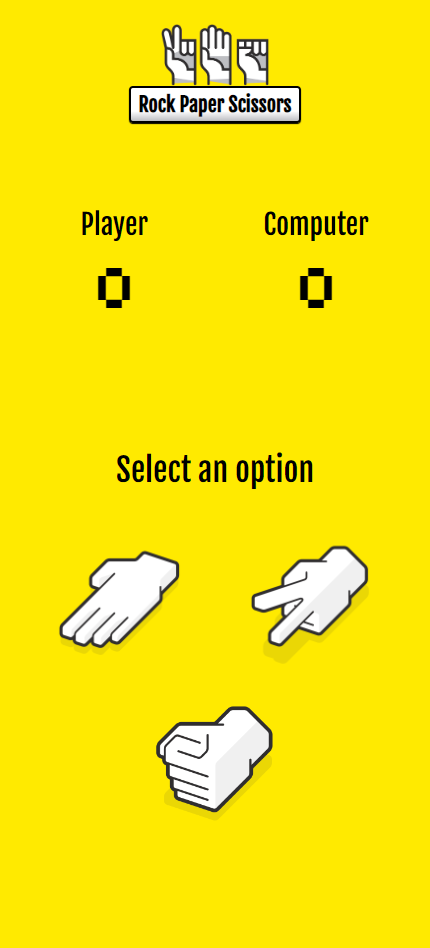
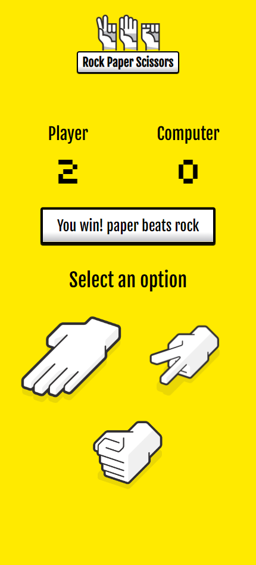
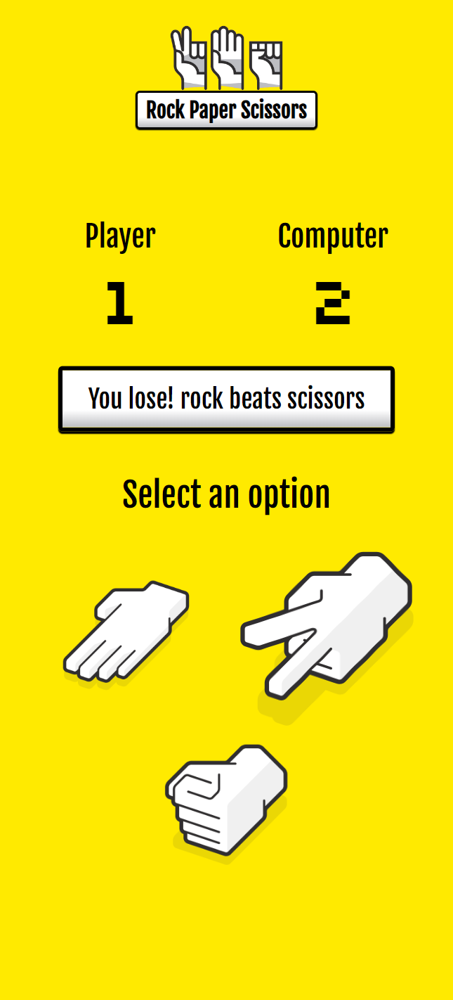

# 


<br>
<br>

This project is a Rock Paper Scissors game built with JavaScript, where players compete against the computer using a graphical user interface (GUI). The game allows players to select their move by clicking buttons, with the outcome and scores displayed dynamically on the page. This project demonstrates essential web development skills, focusing on JavaScript for interactivity, DOM manipulation, and version control using Git and GitHub.

<details open>
<summary>
 Screenshots
</summary> <br />
    
<p align="center">
    
&nbsp;
    
&nbsp;
    
</p>

</details>

## 📝 Project Objective

The focus of this project was on delivering a working game quickly, without spending unnecessary time on perfecting the design or adding extra features. While it's easy to get carried away with enhancing the user experience, visual design, or interactivity, the intention here was to complete the core functionality and move forward, reserving any deeper refinements for future, more polished projects.

## 🔧 Features

- **Interactive GUI**: Players can choose "Rock," "Paper," or "Scissors" using buttons, and the game immediately displays the results on the webpage.

- **Real-Time Scorekeeping**: The game tracks and displays scores for both the player and the computer.

- **Victory Announcement**: The game announces a winner once either the player or the computer reaches 5 points.

- **Git Branching**: The project showcases the use of Git branching for feature development, including the creation, merging, and cleanup of branches.

## 🕹️ How to Play

1. Select "Rock," "Paper," or "Scissors" by clicking the respective button.

2. The computer will randomly choose its move.

3. The result of the round will be displayed, and scores will update accordingly.

4. The first player to reach 5 points wins the game.

## 💾 Installation

1. Clone this repository:

    ```bash
    git clone https://github.com/dsbfelipe/odin-rock-paper-scissors.git
    ````
2. Navigate to the project folder and open the index.html file in your browser.

## 💻 Technologies Used

- **HTML5** for structure

- **CSS3** for styling

- **JavaScript (ES6+)** for game logic and interactivity

- **Git & GitHub** for version control and collaboration

## 💡 Acknowledgements 

- **The Odin Project**: Thank you for providing the guidance and foundation for this project.

- **Sacha Jerrems on Dribbble**: I used his Rock Paper Scissors design for the buttons in my project. You can view the design here: <a href="https://dribbble.com/shots/2193123-Rock-Paper-Scissors">Sacha Jerrems' design</a>.

- **Kiel Johnson on Dribbble**: I used his Roshambo Hands design to improvise a logo for the page. You can view the design here: <a href="https://dribbble.com/shots/2645906-Roshambo-Hands">Kiel Johnson's design</a>.
